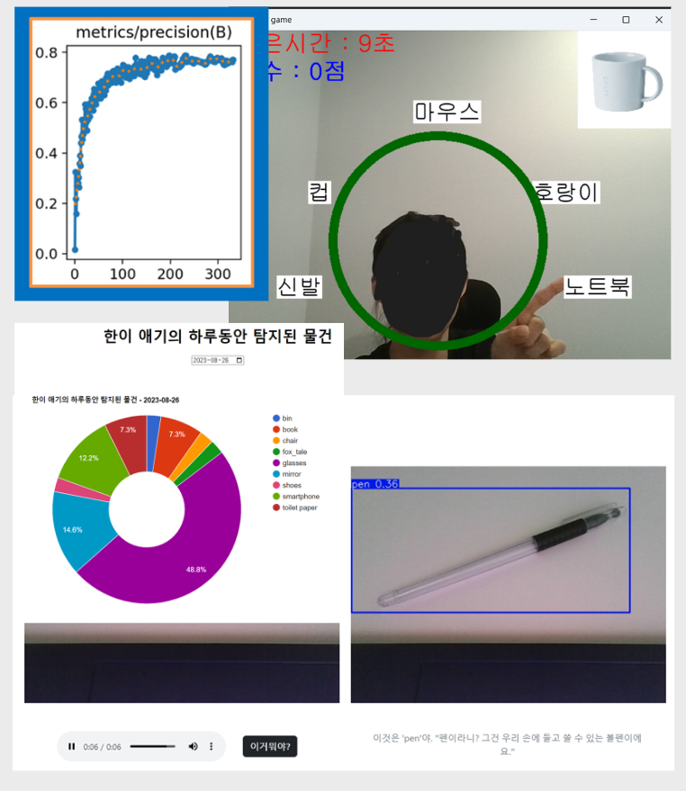

# YOLO를 이용한 유아 교육 서비스

    
    

## 프로젝트 개요
- **개발기간**: 2023.08.01 ~ 2023.08.31
- **플랫폼**: Web
- **개발 인원**: 5명
- **프로젝트 목적**: 
  - 유아들의 호기심을 해결해 주면서 부모가 자녀의 관심사를 손쉽게 알 수 있는 서비스 제작

## 담당 역할
- **Mediapipe와 Yolo v8을 활용한 정밀 객체 인식 기능 개발**
- **GPT API를 통한 사물 설명 및 TTS 구현**
- **Yolo 클래스 확장을 위한 데이터 라벨링 및 전처리 작업**
- **Flask를 이용하여 웹 기반 인터페이스 개발**
- **아이디어 기획 및 프로젝트 결과 발표를 위한 PPT 제작**

## 사용 기술
- **언어**: Python, JavaScript
- **사용기술**: Mediapipe, Yolov8, TTS, GPT API, Flask

## 프로젝트 내용

아이들의 호기심 해결과 부모가 자녀의 관심사를 쉽게 파악할 수 있는 서비스 개발에 초점을 맞췄습니다. Mediapipe와 Yolo v8을 사용해 아이들이 주변 사물을 인식하고, GPT API로 그 사물에 대해 설명합니다. 부모는 이 상호작용을 통해 자녀의 관심사를 파악할 수 있습니다. 프로젝트 '엄마 이거 뭐야?'에서는 객체 검출의 정확도를 위한 라벨링의 중요성을 경험했습니다. YOLO 모델과 GPT를 통한 설명 제공 시스템 개발을 하며, 웹캠 설정, GPT API, TTS, 아이디어 기획, YOLO 클래스 확장 등 다양한 기술에 대한 이해도를 높일 수 있었습니다.

## 기능

1. **객체 인식 및 설명 기능**
   - 어린이들이 주변 사물을 **카메라를 통해 인식** 시킵니다. 그 후에 사물에 대한 설명이 **음성**으로 나오면서 아이들의 궁금증을 해결해 줍니다.

2. **단어 학습 게임 기능**
   - 화면에 표시된 단어에 맞게 아이들이 **손가락으로 그림을 가리킬 때 반응**합니다. 올바르게 가리키면 O 또는 X로 응답하여 **아이들이 단어를 재미있게 학습**할 수 있게 합니다.

3. **아이의 관심사 확인 기능**
   - 이 기능은 아이가 물어본 사물을 토대로, **최근 7일 동안의 관심사를 분석**합니다. 이를 통해 부모는 아이의 관심사에 따라 활동을 계획할 수 있게 됩니다.
